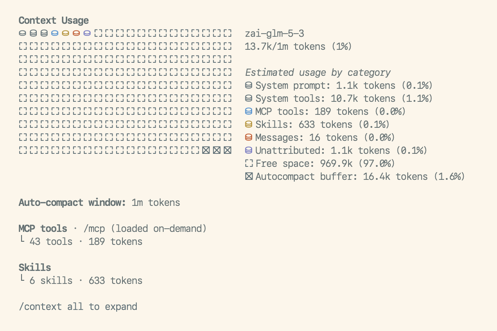

# pi-context-usage

A pi extension that adds `/context`: a report of what fills the context window, laid out like
Claude Code's `/context`.



The report is stored as a session entry that pi shows but never sends to the model, so running
`/context` costs no context.

## Installation

```bash
pi install npm:@graelo/pi-context-usage
```

## Usage

- `/context`: the report above.
- `/context all`: the same report, expanded. It adds one line per tool (costliest first), MCP
  tool, memory file and skill with its token count, and lists the system prompt's sections
  with the category each one is counted in.

## Categories

Pi builds its system prompt from named **sections**, each wrapped in a tag of its own name
(`<skills>…</skills>`, `<project_context>…</project_context>`, …). It records them, along with
the tool schemas it declares, in the session. Every category below is made of sections, tool
schemas, or the conversation. The section names in this table are what the `sections` config
key refers to.

| Id | Label | Default color | Contains | Doesn't contain |
| --- | --- | --- | --- | --- |
| `system` | System prompt | `dim` | Every section no other category claims. With pi 0.99's defaults: `preamble`, `tools`, `rules`, `docs`, `addendum` (your appended system prompt) and `cwd`. The exact set depends on your pi version and extensions; `/context all` lists it. | — |
| `tools` | System tools | `muted` | The schemas (name, description, parameters) of the non-MCP tools declared to the model. | The `tools` *section*: pi's one-line tool summaries in the prompt count in System prompt. |
| `mcp` | MCP tools | `mdLink` | The `mcp_servers` section, plus the schemas of MCP tools declared to the model (`direct` exposure). | MCP tools exposed through codemode or tool search. The model doesn't see them until it loads them, so they cost nothing up front ("loaded on-demand"). |
| `memory` | Memory files | `error` | The `project_context` section: context files such as `AGENTS.md` and `CLAUDE.md`. | — |
| `skills` | Skills | `warning` | The `skills` section: each skill's name, description and file location. Skills marked `disable-model-invocation` are left out. | The skill bodies. Once the model reads a skill's file, that text is a tool result and counts in Messages. |
| `messages` | Messages | `accent` | The conversation: your messages, the model's replies and thinking, tool calls and results, compaction summaries. Images count 1200 tokens each, as in pi. | — |

The rest of the window isn't content, so it only takes `label` and `color`:

| Id | Label | Default color | Meaning |
| --- | --- | --- | --- |
| `unattributed` | Unattributed | `success` | The measured total minus the sum of the category estimates (see below). Hidden when it's zero or less. |
| `free` | Free space | `dim` | What's left: the window minus the total and the buffer. |
| `buffer` | Autocompact buffer | `dim` | pi's `compaction.reserveTokens`. Auto-compaction triggers once the context reaches the window minus this reserve. Hidden when auto-compaction is off. |

### Total, estimates, and Unattributed

The **total** is pi's own context size, measured from the model's last response. It is the
only exact number in the report. Before the first response (or right after a compaction)
nothing is measured yet. The total is then the sum of the estimates, and the report marks it
"estimated".

Every **category** is an estimate: chars/4 by default, or your `tokenizer`.

**Unattributed** is the gap between the two. It's what a tokenizer approximation can't see:
the model's own vocabulary when it differs from your tokenizer's, and the provider's
formatting around prompt, tools and messages (role markers, special tokens). It shrinks as your
`tokenizer` gets closer to the model's.

## Configuration

Optional. The config lives in `config.json` under `extensions/pi-context-usage/`:

- **global**: `~/.pi/agent/extensions/pi-context-usage/config.json`
- **project** (trusted projects only): `<repo>/.pi/extensions/pi-context-usage/config.json`

A project file is merged over the global one key by key. Likewise, `categories` is merged over
the built-in table above, so an entry only needs the keys it changes.

```jsonc
{
  "tokenizer": "tik -e o200k_base",
  "categories": {
    // recolor or relabel a built-in
    "unattributed": { "color": 13 },
    "memory": { "label": "AGENTS.md", "color": "#d75f87" },
    // a new category, claiming sections that would otherwise count as System prompt
    "guidance": { "label": "Pi guidance", "sections": ["rules", "docs"], "color": 109, "after": "tools" }
  }
}
```

`tokenizer` (default `""`): a shell command that reads text on stdin and prints its token
count. Empty means chars/4. If the command fails, the report falls back to chars/4 and says
why.

`categories`: entries keyed by id, either a built-in id from the tables above or a new one.
Each entry takes:

| Key | Meaning |
| --- | --- |
| `label` | Name in the legend and section headings. Required for a new category. |
| `color` | A theme color name (`accent`, `dim`, …), a 256-color index (`0`–`255`), or a color string (`#rrggbb`, `oklch(…)`, `okhsl(…)`). |
| `sections` | Section names this category claims. Required, non-empty, for a new category. On a built-in it replaces the default list, and `[]` gives the sections back to System prompt. Not allowed on `system`, `messages`, or the rest-of-window ids. A section claimed by two categories is a config error. |
| `after` | New categories only: the category to place it after, in the grid and the legend. Default: just before Messages. |

An invalid config is reported at session start, and the defaults are used instead.

## Development

```bash
npm install
npm run check
npm test
pi -e ./src/index.ts
```

The code is split into three layers, so a change in pi only touches one place:

- `src/sources/`: one module per pi data source. Each returns plain items and does no token
  math or rendering.
- `src/categories.ts`: the built-in category table (the default `categories` config) and its
  resolution. It's the only mapping from pi's concepts to report categories.
- `src/aggregate.ts` builds the snapshot, and `src/report/` renders it.

## License

MIT
